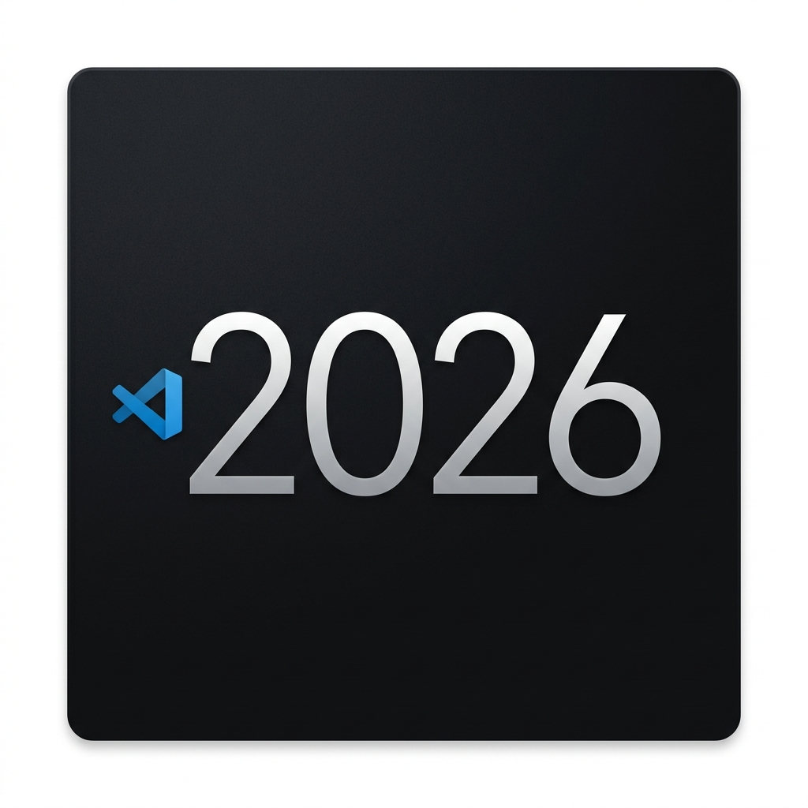

  
  <h1>2026 Dark — Zed Theme</h1>
  
A meticulous port of Microsoft’s official <b>VS Code 2026 Dark</b> theme for the <a href="https://zed.dev">Zed</a> editor.

---

## 🎨 Overview

This extension brings the next-generation default dark theme from VS Code (2026 Dark) to Zed. It focuses on clarity, deep contrast, and a modern aesthetic that balances professionality with visual comfort.

## ✨ Key Features

*   **Faithful Port**: Re-engineered by integrating the full inheritance chain from VS Code’s `Dark Modern` and `2026 Dark` sources.
*   **Deep Contrast**: Optimized background (`#121314`) and sidebar (`#191A1B`) layers to reduce eye strain.
*   **Modern Syntax**: High-quality Tree-sitter highlighting based on GitHub's color palette (Purple functions, Red keywords, etc.).
*   **Full UI Support**: Comprehensive coverage for Git status, editor gutters, matching markers, collaborative cursors, and terminal ANSI colors.

## 🚀 Installation

### Development Mode (Sideloading)

1. Clone or download this repository.
2. In Zed, open the Command Palette (`Cmd/Ctrl + Shift + P`).
3. Run **"zed: install dev extension"** and select the repository folder.
4. Go to **Settings → Theme** and select **"2026 Dark"**.

## 📜 Technical Mapping

| VS Code Scope | Zed Semantic Role | Hex |
| :--- | :--- | :--- |
| `editor.background` | `editor.background` | `#121314` |
| `keyword`, `storage` | `keyword`, `type` | `#ff7b72` |
| `entity.name.function` | `function` | `#d2a8ff` |
| `entity.name.tag` | `tag` | `#7ee787` |
| `variable.parameter` | `variable.parameter` | `#c9d1d9` |

## 📜 License

This project is released under the **MIT License**. Original theme design by **Microsoft**. Ported for Zed by **[chrocy](https://github.com/lxhzz)**.
