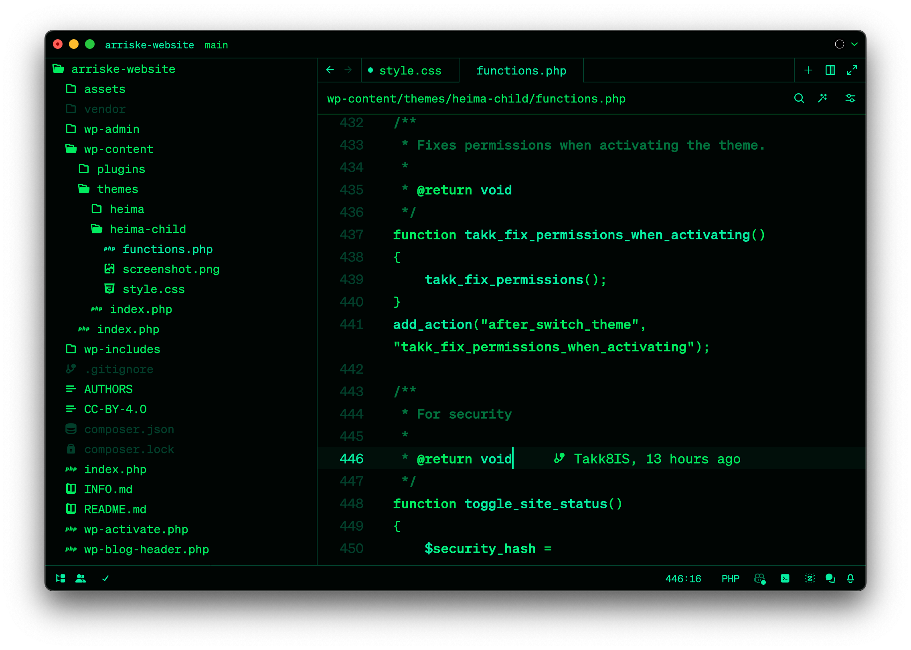

# Green Monochrome Monitor CRT Phosphor Theme for Zed

The "Green Monochrome Monitor CRT Phosphor" brings the nostalgic essence of vintage green phosphor monitors to your Zed editor. This theme is crafted to offer a unique and immersive visual experience, capturing the original charm of early computing displays. Available in both dark and light versions, the Green Monochrome Monitor CRT Phosphor Theme transforms your coding environment with its distinct green-on-black and green-on-light-green aesthetics.

## Theme Variants

The theme includes eight distinct variants, each designed to emulate specific types of CRT phosphors:

### Green Monochrome Monitor CRT Phosphor Dark

### Green Monochrome Monitor CRT Phosphor Dark P1

### Green Monochrome Monitor CRT Phosphor Dark P31

### Green Monochrome Monitor CRT Phosphor Dark P39 I

### Green Monochrome Monitor CRT Phosphor Dark P39 II

### Green Monochrome Monitor CRT Phosphor Light

### Green Monochrome Monitor CRT Phosphor Light P1

### Green Monochrome Monitor CRT Phosphor Light P31

### Green Monochrome Monitor CRT Phosphor Light P39 I

### Green Monochrome Monitor CRT Phosphor Light P39 II

## Theme Overview

The "Green Monochrome Monitor CRT Phosphor" is designed to evoke the look and feel of classic CRT monitors, emphasizing simplicity and readability. The dark versions feature a predominantly black background with vibrant green text and accents, while the light versions introduce a softer green background for a refreshing contrast. Both versions maintain a consistent color scheme that is easy on the eyes and suitable for long coding sessions.

### Installation Instructions

**1. Manual Install**

-   **Download**: Download the theme files (`green-monochrome-monitor-crt-phosphor.json`) from the repository.
-   **Add**: Move the downloaded JSON file to the `~/.config/zed/themes/` directory on your macOS.
-   **Activate**: Open the Command Palette in Zed by typing `theme selector: toggle`, then search for "Green Monochrome Monitor CRT Phosphor" to apply the theme.

**2. Install via Command Palette**

-   **Open**: Open the Command Palette in Zed by navigating to the menu and selecting `Go > Open Command Palette...`.
-   **Type**: Type `extensions` or `zed: extensions` in the Command Palette.
-   **Search**: Search for "Green Monochrome Monitor CRT Phosphor" and install it directly from the extension marketplace.

**3. Activate**

-   **Open**: Open the Command Palette in Zed by navigating to the menu and selecting `Go > Open Command Palette...`.
-   **Type**: Type `theme selector: toggle`.
-   **Search**: Search for "Green Monochrome Monitor CRT Phosphor" and select it from the list to activate the theme.

## Theme Details

### Green Monochrome Monitor Dark Theme

-   **Accent Colors**: Various shades of green for borders, highlights, and syntax elements.
-   **Syntax Highlighting**: Strong emphasis on readability with bold green text for keywords, strings, and other elements.

### Green Monochrome Monitor Light Theme

-   **Accent Colors**: Light green tones for borders, highlights, and syntax elements.
-   **Syntax Highlighting**: Enhanced visibility with lighter green text for keywords, strings, and other elements.

Both versions of the theme ensure a cohesive and immersive experience, making your coding environment visually appealing and reminiscent of classic green phosphor monitors.

## Phosphor Specific Details

### P1 (Green Monochrome Monitor CRT Phosphor P1)

-   **Color**: #00FF00 (Green Pure)
-   **Application**: General purpose oscilloscopes and radar.

### P31 (Green Monochrome Monitor CRT Phosphor P31)

-   **Color**: #7FFF00 (Green Yellowish)
-   **Application**: Display tubes and oscilloscopes.

### P39 (Green Monochrome Monitor CRT Phosphor P39)

-   **Color**: #006400 (Green Dark)
-   **Application**: Display tubes.

## Support

Experience the power of Zed by visiting their [official website](https://zed.dev/).

To contribute to public and social projects focused on research and artificial intelligence, feel free to support with any amount you prefer.

## About the Author

### Takk™ Innovate Studio

-   **Author**: David C Cavalcante
-   **LinkedIn**: [David C Cavalcante](https://www.linkedin.com/in/hellodav/)
-   **Medium**: [David C Cavalcante](https://medium.com/@davcavalcante/)
-   **Positive results, rapid innovation**
-   **Leading the Digital Revolution as the Pioneering 100% Artificial Intelligence Team**
-   **URL**: [Takk](https://takk.ag/)
-   **Twitter**: [Takk](https://twitter.com/takk8is/)
-   **Medium**: [Takk](https://takk8is.medium.com/)

Enjoy coding with the nostalgic and visually soothing aesthetics of the Green Monochrome Monitor CRT Phosphor Theme. Whether you prefer the dark version's striking green-on-black contrast or the light version's refreshing green tones, this theme will enhance your Zed editor experience with a touch of vintage charm.
