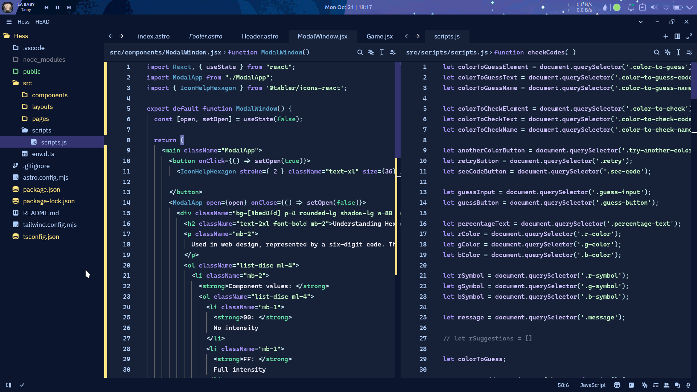
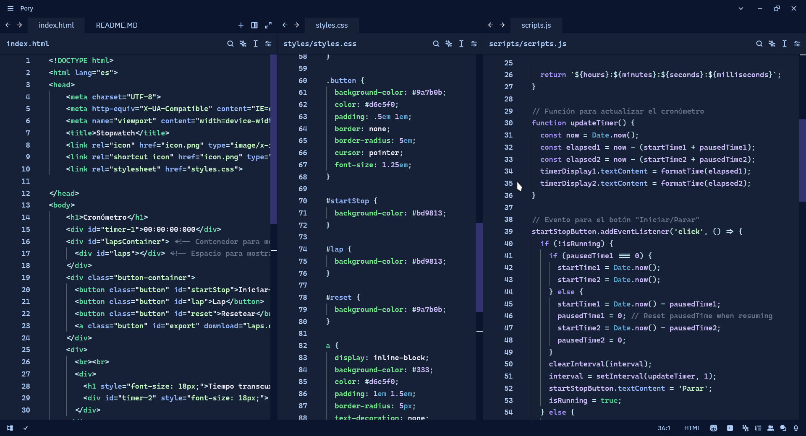
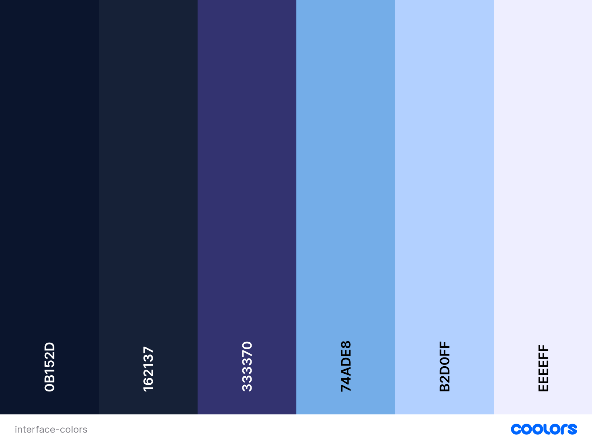
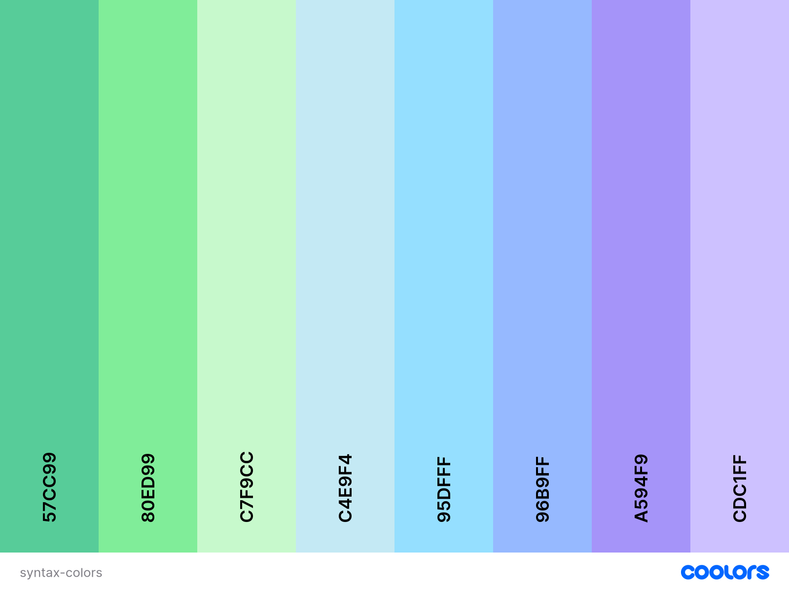
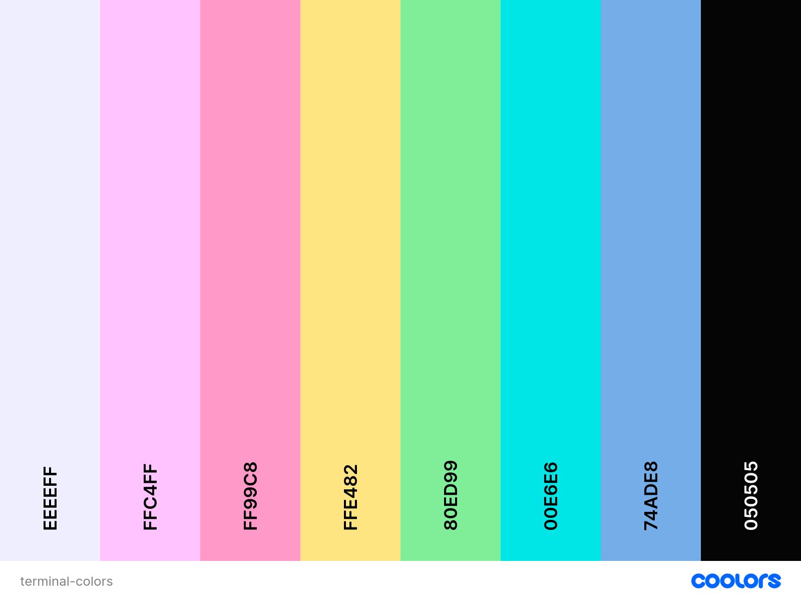

# Adech Theme for Zed Editor

Inspired by **cold colors**, it comes a theme for coding at night, with rain in the background.

### Pallettes
#### Interface colors

#### Syntax colors

#### Terminal colors

## Installation and Use
Sadly, **Adech Theme** is not yet available in Zed Extensions .

Until then, you can install it by downloading the `adech.json` in the `.config/zed/themes` and activate it in the `Themes Options`.

## How to contribute
Everyone is free to fork, make changes and fix issues 😄.
