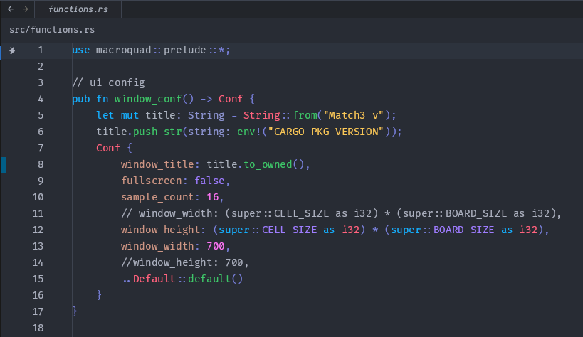

# DeniX theme for the Zed editor

This repo contains Denix theme for the [Zed](https://zed.dev) editor.

## Screenshots

## Manual install
- Copy the `themes/*.json` files from this repo into `~/.config/zed/themes`.
- Select your theme (Settings -> Select Theme).
