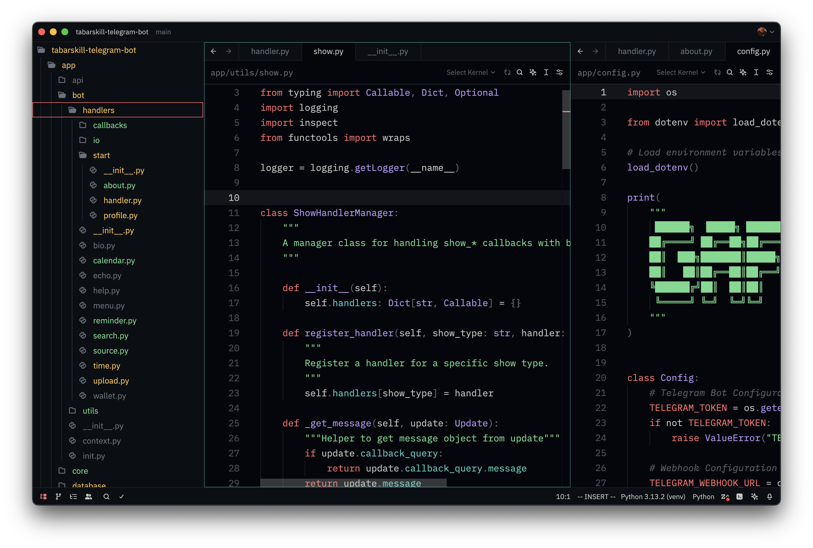

# Gafelson Theme for Zed

A clean, focused, and aesthetically pleasing dark theme for [Zed](https://zed.dev), designed for developers who appreciate both elegance and simplicity.

---

## 🎨 Theme Highlights

* Balanced contrast for long coding sessions
* Subtle syntax coloring for minimal eye strain
* Smooth integration with Zed's sleek UI
* Comes in multiple variants with evolving styles

---

## 📸 Preview



---

## 🛠 Manual Installation

To install the theme manually:

1. Clone or download this repository.
2. Copy all `.json` files from the `themes/` directory to your Zed themes folder:

   ```bash
   cp themes/*.json ~/.config/zed/themes
   ```
3. Open Zed, go to **Settings → Theme**, and select your preferred Gafelson variant.

---

## 💬 Feedback & Contributions

If you have suggestions, improvements, or want to contribute new variants, feel free to open an issue or pull request.

---

Crafted with focus by [Gafelson](https://github.com/gafelson) 🖤

---

Let me know if you want a **light mode preview**, **installation script**, or **badge styling** added to make it even more polished.
