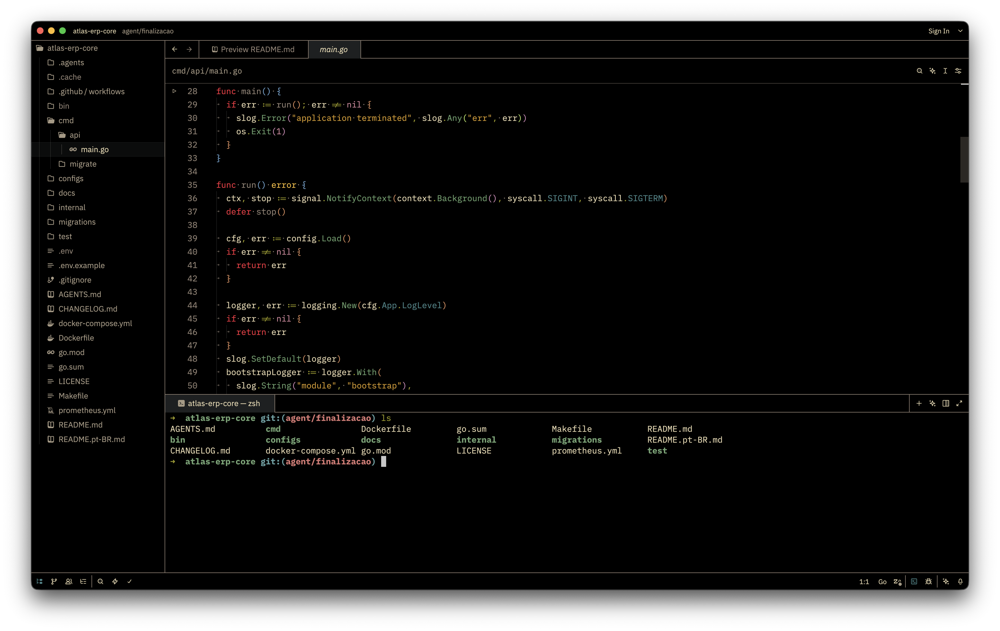
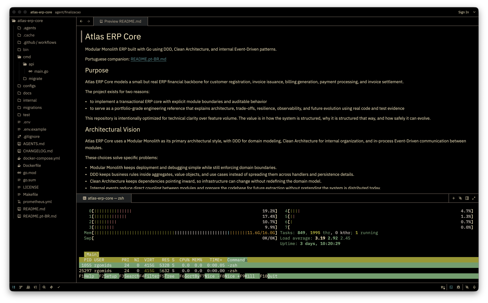

# popping-and-locking-black-zed-theme

A Zed port and derivative of the original **Popping and Locking** theme.

This theme is based on the original project [`randoneering/popping-and-locking-zed-theme`](https://github.com/randoneering/popping-and-locking-zed-theme), which itself is a port inspired by the **Popping and Locking** theme used across tools like iTerm2, Ghostty, Atom, and VSCode.

This fork focuses on a darker black-based variant for Zed, with adjusted UI, terminal, and syntax colors.

## Credits

Original Zed port by **randoneering**:  
[`randoneering/popping-and-locking-zed-theme`](https://github.com/randoneering/popping-and-locking-zed-theme)

This repository is a derivative work built on top of that project, with additional customization and color adjustments.

## Screenshots

## ANSI Color Palette

| Color | ANSI |
|------|------|
| Black | `#1d2021` |
| Red | `#cc241d` |
| Green | `#98971a` |
| Yellow | `#d79921` |
| Blue | `#458588` |
| Magenta | `#b16286` |
| Cyan | `#689d6a` |
| White | `#a89984` |
| Bright Black | `#928374` |
| Bright Red | `#f42c3e` |
| Bright Green | `#b8bb26` |
| Bright Yellow | `#fabd2f` |
| Bright Blue | `#99c6ca` |
| Bright Magenta | `#d3869b` |
| Bright Cyan | `#7ec16e` |
| Bright White | `#ebdbb2` |

## Theme Details

- **Name:** Popping and Locking Black
- **Author:** rgomids
- **Appearance:** dark
- **Schema:** `https://zed.dev/schema/themes/v0.2.0.json`

## Notes

This version changes the theme direction toward a pure black UI background while preserving the original Popping and Locking palette identity as much as possible within Zed's theme model.

Contributions and refinements are welcome.
