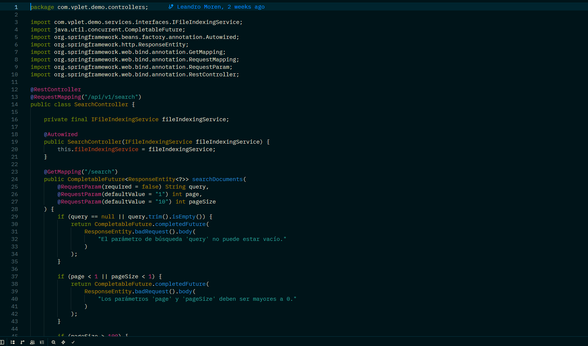
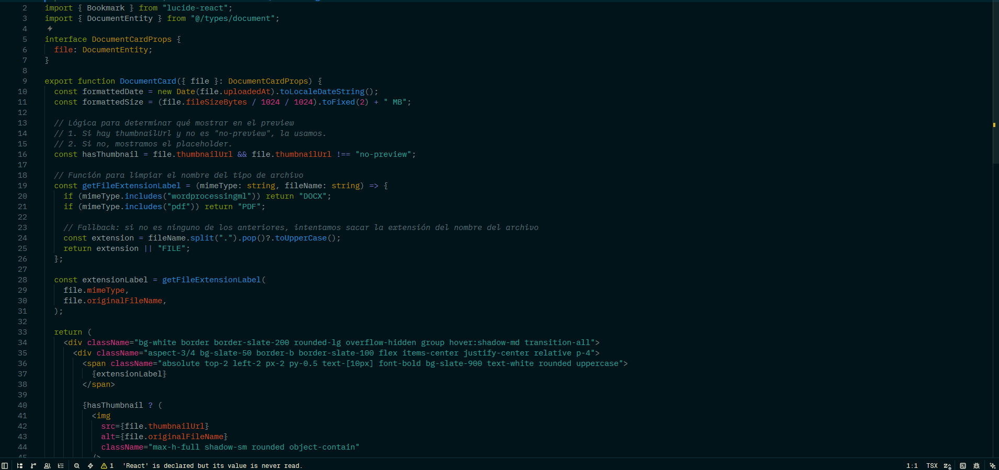

# Solarized Osaka for Zed

A Solarized-inspired dark theme for Zed, blending Japanese night aesthetics with cyberpunk colors.

## Features

- Optimized for Java + Spring
- Warm annotation colors
- Deep teal backgrounds
- Comfortable long coding sessions

## Languages tested

- Java
- TypeScript

# Solarized Osaka for Zed

## Java + Spring

## TypeScript

## Installation

Install directly from Zed extensions (coming soon) or as a dev extension.